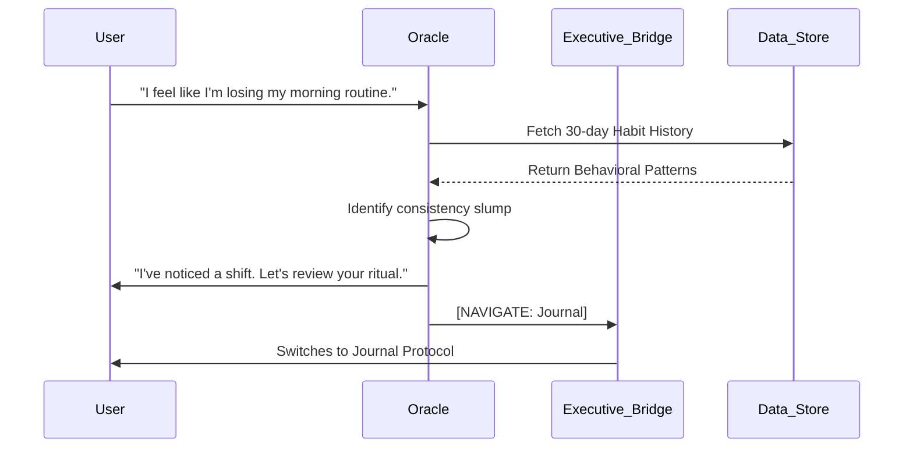

# 
 FlowOS: The Mobile Intelligence Protocol

  <b>The First Mobile-Exclusive, Local-First, Agentic Operating System.</b> 
  <i>Synchronizing human execution with autonomous machine precision.</i>

  
  
  
  

---

## 🌌 The Vision: V2.5 "Neural Sync"
**FlowOS** has evolved from a task manager into a **Mobile Agentic OS**. In the V2.5 update, we introduced the **Neural Sync** protocol—a high-performance streaming architecture that connects the Oracle AI directly to your device's executive functions.

---

## ⚡ Core Intelligence Pillars

### 1. **Life Guidance & Consistency (New)**
The **Oracle** has evolved from a passive assistant into a **Life Guidance Coach**. It focuses on understanding your unique life rhythms to ensure absolute consistency.
*   **Biological Synchronization**: The AI analyzes your energy levels and task completion patterns to guide you toward your peak performance windows.
*   **App-Centric Boundaries**: The AI operates strictly within the FlowOS environment. It doesn't interfere with your system hardware, focusing instead on optimizing your internal protocol and focus state.
*   **Proactive Guidance**: Instead of just executing commands, the AI provides empathetic coaching and can navigate you to relevant app features (like your Journal or Flow list) when it senses you need a moment of reflection or realignment.

### 2. **Self-Learning Engine (Long-Range)**
Experience intelligence that grows with you.
*   **Macro-Pattern Detection**: The engine now analyzes up to 100 historical memories to identify long-term behavioral shifts, cognitive slumps, and weekly cyclical patterns.
*   **Insight Cross-Referencing**: New observations are continuously checked against historical insights to track your evolution over months, not just days.
*   **Memory Refinement**: Automatic consolidation of similar memories ensures your "Flow Context" remains high-density and relevant.

### 3. **Total Data Sovereignty**
We maintain absolute data isolation.
*   **Local-Only Protocol**: No remote auth. Your identity, keys, and behavioral patterns stay exclusively on your hardware.
*   **Encrypted AI Vault**: Securely manage your AI Studio and universal API keys with hardware-backed encryption.
*   **Privacy-First Design**: The Oracle's reasoning happens within a localized context that is never stored or shared.

---

## 🛠 Technical Architecture

| Component | Technology | Role |
|-----------|------------|------|
| **Frontend** | Jetpack Compose | High-density HUD |
| **Streaming** | Kotlin Flow (SSE) | Real-time Neural Sync |
| **Intelligence** | Gemini 1.5 Flash | Core Agentic Reasoning |
| **Data Engine** | Room Persistence | Local State Sovereignty |
| **Orchestration** | HomeViewModel | Autonomous Intent Bridge |

### **The "Executive Control" Loop**

---

## 🛡 Privacy Policy: Total Sovereignty
**Your mind is yours.** FlowOS implements absolute data isolation.
*   **Offline First**: Core functionality remains 100% operational without an internet connection.
*   **No Trackers**: Zero analytics. Zero telemetry. Zero third-party SDKs.
*   **Biometric Guard**: Protect your private journal and AI configurations with native biometric security.

---

## 🚀 Installation & Setup

### **1. Build from Source**
*   **Clone**: `git clone https://github.com/patil-shubham-dev/FlowOS.git`
*   **Environment**: Android Studio Ladybug+
*   **API Key**: Add `AI_STUDIO_API_KEY` to your `local.properties`.

### **2. Operation Manual**
1.  **Initialize**: Set your Display Name and Core Goal in Settings.
2.  **Sync**: Long-press the AI trigger to start a conversation.
3.  **Command**: Ask the Oracle to "Add a task for my project" or "Check my schedule."

---

  <b>FlowOS V2.5: The Execution Protocol for the Elite.</b> 
  <i>Autonomous. Local. Faster than thought.</i>

