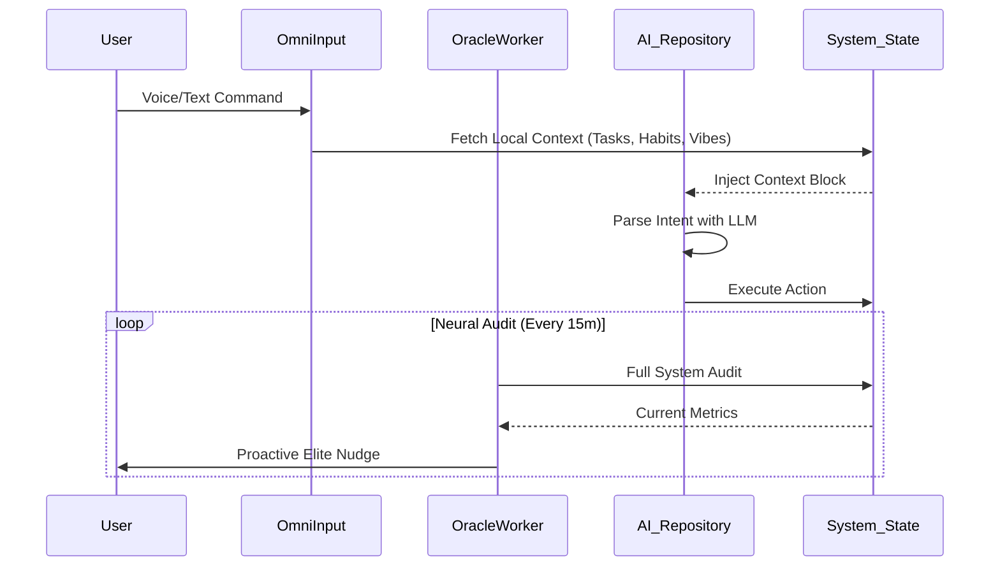

# <p align="center"><br>FlowOS: The Mobile Intelligence Protocol</p>

<p align="center">
  <b>The First Mobile-Exclusive, Local-First, Performance-Obsessed Intelligence Operating System.</b><br>
  <i>Synchronizing human execution with machine precision on the go.</i>
</p>

<p align="center">
  
  
  
  
</p>

---

## 🌌 The Vision
**FlowOS** is a **Mobile-First Neural Augmentation Layer** designed for high-performance individuals who demand absolute sovereignty over their data and cognitive state. It transforms your mobile device into a dedicated intelligence hub, leveraging advanced AI agents to audit your life in real-time.

---

## ⚡ Core Intelligence Pillars

### 1. **Neural System Audits (Oracle AI)**
The **Oracle** is the heart of FlowOS. It doesn't wait for you to check your tasks; it audits the entire system state synchronously.
*   **Deep Context Sensing**: Analyzes tasks, habits, and journal vibes to build a real-time "System Context."
*   **Proactive Nudging**: Automatically detects flow divergences and delivers "Elite Agentic Nudges" to maintain momentum.
*   **Autonomous Intent Parsing**: Understands natural language commands (Text & Voice) and maps them to system actions with zero latency.

### 2. **BYOK (Bring Your Own Key) Orchestration**
Total autonomy through model flexibility. FlowOS acts as a universal bridge to the world's most powerful LLMs.
*   **Multi-Provider Support**: Seamlessly switch between OpenAI (GPT-4o), Anthropic (Claude 3.5), Google (Gemini), Nvidia (NIM), and Groq.
*   **Local Inference Ready**: Built with an architecture that prioritizes local vector embeddings and future on-device SLM support.

### 3. **Omni-Input Command Center**
A futuristic, voice-enabled interface inspired by Jarvis.
*   **Jarvis Waveform Animation**: A custom canvas-based visualizer that pulses during active listening.
*   **Voice-to-Execution**: Real-time Whisper-powered transcription and intent execution.
*   **Glassmorphic Overlay**: A premium HUD that floats over the OS, accessible via a single gesture.

---

## 🎨 Premium Aesthetics: "Deep Obsidian"
FlowOS is designed for focus. The UI follows a strict **"Deep Obsidian & Electric Blue"** design system.
*   **OLED Optimization**: Pure blacks (#0B0B0F) for maximum energy efficiency and visual depth.
*   **Neural Orb**: A central dashboard visualizer representing your "Flow Score" through multi-layer radial gradients and rotating energy rings.
*   **Haptic Rich Feedback**: Every interaction is anchored with subtle, high-frequency haptics to simulate a neural interface.

---

## 📱 Mobile-First Architecture
FlowOS is engineered exclusively for mobile environments. It is **not** designed for tablets or desktops, as its cognitive models are tuned for high-frequency, on-the-go interactions.
*   **OLED Pure Black**: Optimized for mobile battery longevity and night-time reflection.
*   **One-Handed Omni-HUD**: All intelligence triggers are positioned for easy thumb access.
*   **Background Orchestration**: Leverages Android WorkManager for low-power neural auditing.

---

## 🛠 Technical Architecture

| Component | Technology | Role |
|-----------|------------|------|
| **Frontend** | Jetpack Compose | Modern, declarative HUD |
| **State Management** | Kotlin Flow & Coroutines | Asynchronous orchestration |
| **Intelligence Layer** | Retrofit / OpenAI-KMP | Multi-provider API Gateway |
| **Voice Processing** | Android Speech Engine | Voice-to-Text interaction |
| **Local Storage** | Room / Encrypted SharedPreferences | Data sovereignty & security |
| **Background Ops** | WorkManager | Autonomous Oracle Auditing |

### **The "Neural Audit" Loop**


---

## 🛡 Privacy & Sovereignty
**Your mind is yours.** FlowOS implements absolute data isolation.
*   **Zero Cloud Dependence**: Your tasks, habits, and journals stay on your device.
*   **Biometric Identity Lock**: Critical protocol layers (Sync/Journal) are protected by a mandatory biometric gateway.
*   **Encrypted API Storage**: All neural keys are stored in encrypted system storage, never exposed to third-party trackers.

---

## 🚀 Installation & Setup

FlowOS is a **Native Android Application**. Follow these steps to initialize the protocol on your mobile device.

### **1. Prerequisites**
*   **Android Device**: Running Android 8.0 (API 26) or higher.
*   **Android Studio**: Ladybug or newer (for building from source).
*   **Memory**: Minimum 4GB RAM recommended for on-device ONNX models.

### **2. Clone & Build**
```bash
# Clone the repository
git clone https://github.com/patil-shubham-dev/FlowOS.git

# Open the project in Android Studio
# Wait for Gradle to sync (includes downloading ONNX MiniLM models)
```

### **3. API Configuration**
FlowOS requires an external Intelligence Key to power the Oracle.
1. Create a `local.properties` file in the root directory (if not present).
2. Add your Google AI Studio key:
   ```properties
   AI_STUDIO_API_KEY=your_key_here
   ```

### **4. Deployment**
1. Connect your Android device via USB or WiFi Debugging.
2. Click **Run 'app'** in Android Studio.
3. Accept the mandatory **Biometric & Audio permissions** upon first launch.

---

## 🛠 Operation Manual

1.  **Establish Neural Links**: Navigate to **System > AI Protocol** and input your preferred provider key (OpenAI/Claude/Nvidia).
2.  **Enter Flow State**: Long-press the **Omni-Input (Add)** button to trigger voice dictation or tap for text input.
3.  **Trust the Oracle**: FlowOS will begin background auditing automatically. Check the **Oracle tab** for proactive nudges.

---

<p align="center">
  <b>FlowOS V2.2: The Execution Protocol for the Elite.</b><br>
  <i>Built for those who refuse to be managed.</i>
</p>
