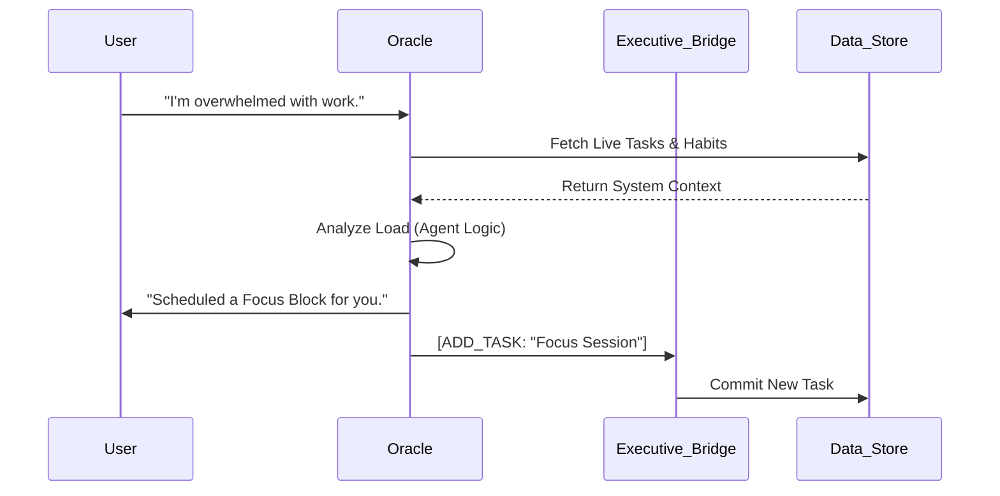

# 
 FlowOS: The Mobile Intelligence Protocol

  <b>The First Mobile-Exclusive, Local-First, Agentic Operating System.</b> 
  <i>Synchronizing human execution with autonomous machine precision.</i>

  
  
  
  

---

## 🌌 The Vision: V2.5 "Neural Sync"
**FlowOS** has evolved from a task manager into a **Mobile Agentic OS**. In the V2.5 update, we introduced the **Neural Sync** protocol—a high-performance streaming architecture that connects the Oracle AI directly to your device's executive functions.

---

## ⚡ Core Intelligence Pillars

### 1. **Autonomous Executive Control (New)**
The **Oracle** is now an active agent with full system awareness. It doesn't just talk; it acts.
*   **System Awareness (Read)**: The Oracle possesses a live bridge to your tasks, habits, and journals. It analyzes your patterns to provide hyper-personalized coaching.
*   **Executive Intent (Write)**: The Oracle can autonomously perform actions. It can add tasks, establish new habits, and reorganize your schedule based on your "Flow" state.
*   **Direct Interaction**: Stripped of conversational fluff, the Oracle now provides high-density, direct answers to your queries.

### 2. **Neural Sync Streaming**
Experience zero-latency intelligence.
*   **Token-by-Token Streaming**: Leveraging Google Gemini 1.5 Flash, FlowOS streams AI responses in real-time, eliminating waiting periods for full payloads.
*   **High-Density Typography**: Optimized Claude-inspired document reading experience with tuned line heights for mobile devices.
*   **Optimized Latency**: Model-specific tuning (Temperature 0.3, Max Tokens 512) for the snappiest mobile AI experience available.

### 3. **Total Data Sovereignty**
We have eliminated all external authentication dependencies.
*   **Local-Only Protocol**: No Firebase, no remote auth. Your identity, keys, and data stay exclusively on your hardware.
*   **Encrypted API Vault**: Securely manage your AI Studio, OpenAI, and Anthropic keys with hardware-backed encryption.
*   **Privacy-First Design**: Even the Oracle's reasoning happens within a localized "Flow Context" that is never stored on a server.

---

## 🛠 Technical Architecture

| Component | Technology | Role |
|-----------|------------|------|
| **Frontend** | Jetpack Compose | High-density HUD |
| **Streaming** | Kotlin Flow (SSE) | Real-time Neural Sync |
| **Intelligence** | Gemini 1.5 Flash | Core Agentic Reasoning |
| **Data Engine** | Room Persistence | Local State Sovereignty |
| **Orchestration** | HomeViewModel | Autonomous Intent Bridge |

### **The "Executive Control" Loop**

---

## 🛡 Privacy Policy: Total Sovereignty
**Your mind is yours.** FlowOS implements absolute data isolation.
*   **Offline First**: Core functionality remains 100% operational without an internet connection.
*   **No Trackers**: Zero analytics. Zero telemetry. Zero third-party SDKs.
*   **Biometric Guard**: Protect your private journal and AI configurations with native biometric security.

---

## 🚀 Installation & Setup

### **1. Build from Source**
*   **Clone**: `git clone https://github.com/patil-shubham-dev/FlowOS.git`
*   **Environment**: Android Studio Ladybug+
*   **API Key**: Add `AI_STUDIO_API_KEY` to your `local.properties`.

### **2. Operation Manual**
1.  **Initialize**: Set your Display Name and Core Goal in Settings.
2.  **Sync**: Long-press the AI trigger to start a conversation.
3.  **Command**: Ask the Oracle to "Add a task for my project" or "Check my schedule."

---

  <b>FlowOS V2.5: The Execution Protocol for the Elite.</b> 
  <i>Autonomous. Local. Faster than thought.</i>

