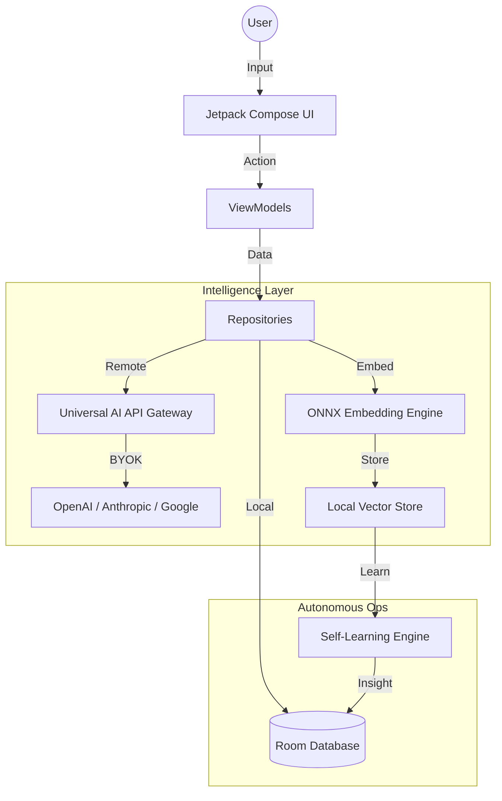

# 🧠 FlowOS: Autonomous Intelligence Operating System

[](https://kotlinlang.org)
[](https://developer.android.com)
[]()
[]()

> **The world's first local-first, performance-obsessed intelligence operating system designed to synchronize your execution with your biology.**

FlowOS is not a task manager. It is a **neural augmentation layer** for your daily life. It leverages on-device vector embeddings, multi-provider LLM orchestration, and biological synchronization to help you achieve a state of consistent "Flow."

---

## 🚀 Key Technological Pillars

### 1. **BYOK Intelligence Orchestration**
FlowOS supports the world's most powerful AI models through a unified **"Bring Your Own Key"** architecture.
- **Providers**: OpenAI (GPT-4o), Anthropic (Claude 3.5 Sonnet), Google (Gemini), Nvidia (NIM), and Groq.
- **Dynamic Tooling**: The Oracle AI can autonomously manage your habits, tasks, and journals via natural language.
- **Whisper Integration**: High-fidelity AI transcription for your reflections and notes.

### 2. **Local-First Vector Memory (Neural Engine)**
Your data never leaves your device. FlowOS implements a professional-grade memory system:
- **On-Device Embeddings**: Powered by **ONNX Runtime** and **MiniLM-L6-v2**.
- **Vector Retrieval**: Cosine similarity search for long-term fact and preference recall.
- **Self-Learning**: An autonomous engine that detects behavioral patterns and deduplicates insights while you sleep.

### 3. **Bio-Synchronization Architecture**
Execute tasks when your energy is highest.
- **Time-Block Adherence**: Sophisticated logic that calculates your "Sync %" based on circadian alignment.
- **Conflict Resolution**: AI-driven detection of energy overload and priority collisions.
- **Health Integration**: Foundation for Google Fit/Health Connect tracking steps, sleep, and HRV.

### 4. **Premium "OLED-First" Design**
A UI designed for high-performance individuals:
- **Aesthetics**: Deep black (#0B0B0F) glassmorphism with electric purple accents.
- **Micro-interactions**: Haptic-rich feedback, smooth expanding card transitions, and ambient glows.
- **Privacy**: Integrated Biometric Identity Lock for total data isolation.

---

## 🛠 Tech Stack

- **Frontend**: Jetpack Compose (Modern Declarative UI)
- **Data Layer**: Room Database (Local Persistence), Encrypted SharedPreferences
- **AI/ML**: ONNX Runtime (Local Inference), Retrofit (Multi-provider API Gateway)
- **Networking**: OkHttp3 with Multipart support (for Whisper audio)
- **Dependency Management**: Manual Dependency Injection for maximum control

---

## 🏗 System Architecture



---

## 📦 Installation & Setup

1. **Clone the repository**:
   ```bash
   git clone https://github.com/patil-shubham-dev/FlowOS.git
   ```
2. **Configure API Keys**:
   - Open FlowOS on your device.
   - Navigate to **Settings > AI Protocol**.
   - Input your OpenAI, Anthropic, or Nvidia keys.
3. **Build & Run**:
   - Ensure you have **Android Studio Flamingo+** installed.
   - Sync Gradle and run the `:app` module.

---

## 🛡 Privacy Policy

FlowOS is built on the principle of **Absolute Data Sovereignty**. 
- No cloud sync.
- No analytics trackers.
- All AI keys are stored in encrypted system storage.
- All vector embeddings are generated and stored locally.

---

## 📄 License

This project is licensed under the MIT License - see the [LICENSE](LICENSE) file for details.

---

<p align="center">
  <b>Built for the focused. Built for the disciplined. Built for Flow.</b>
</p>
